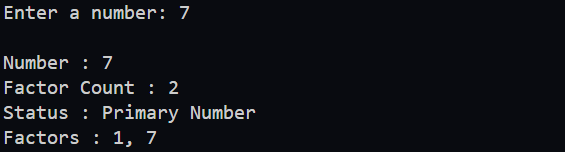
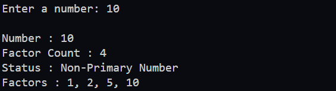

### Add Feature to Display Factors

  *Add a new feature to the program that displays the factors of a number. This feature should be able to display all factors.*

- Hint: use `List` to store factors and then print them out.

---

#### Expected Output



---



---

#### how to use `List` in java.

```java
import java.util.List;        // Importing the List interface
import java.util.ArrayList;   // Importing the ArrayList class

class Test {
    public static void main(String[] args) {
        // Create a list to store integer factors
        List<Integer> factors = new ArrayList<>(); // Initializes an empty list: []

        // Add values to the list
        factors.add(10); // List now contains: [10]
        factors.add(12); // List now contains: [10, 12]
        factors.add(14); // List now contains: [10, 12, 14]

        // Print the element at index 0 of the list
        System.out.println(factors.get(0)); // Outputs: 10

        // Print the element at index 1 of the list
        System.out.println(factors.get(1)); // Outputs: 12

        // Iterate over the list using a for-loop
        for (int i = 0; i < factors.size(); i++) {
            // Retrieve and print the element at the current index
            System.out.println(factors.get(i));
        }
        // Outputs:
        // 10
        // 12
        // 14
    }
}

```


