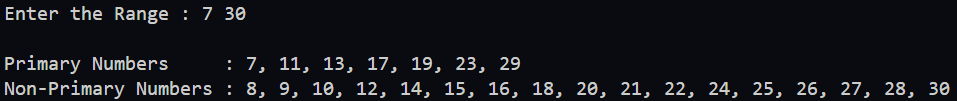
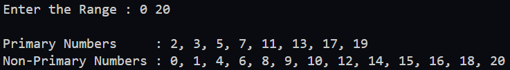
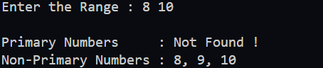
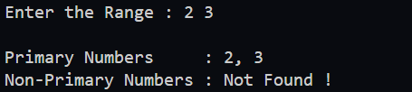
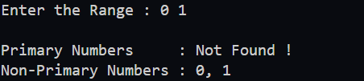

## Write a program to display all prime and non-prime numbers within a given range.

### Your program should:

1. Prompt the user to input two numbers representing the start and end of the range.
2. Identify and separate the prime and non-prime numbers within the specified range.
3. Store the prime numbers and non-prime numbers in separate lists.
4. Display the results in a clear and user-friendly format.
 
### Additional Instructions:
- If no prime or non-prime numbers are found within the range, display an appropriate message such as "Not Found!".

**Hint**:
`Use a list to store prime numbers and another list for non-prime numbers, and then print them out after processing the range.`

### Expected Output

---

---

---

---

