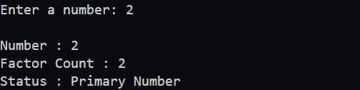
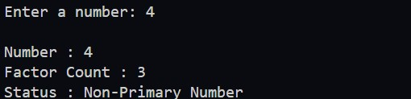

### Write a program to check whether a number is a prime number or not.

- Hint: A prime number is a number that has only two factors - 1 and itself.

#### Get the Input Number:

- First, prompt the user to input a number.

#### Check if the Number is Prime:

- To determine if the number is prime, we need to calculate its factor count. A factor of a number is any integer that divides the number without leaving a remainder.

- How would you do this as a human?
  - Start by dividing the number by 1 (which will always work).

  - Then, divide the number by all integers from 1 up to the number itself.
      
  - Count how many numbers divide the given number evenly (without a remainder).
     
#### Use the Factor Count to Determine if the Number is Prime:

  - If the number has exactly two factors (1 and the number itself), it is a prime number.
  - If the number has more than two factors, it is not a prime number (i.e., it's a non-primary number).

#### Expected Output

---

