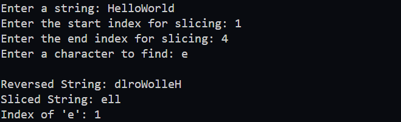
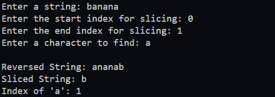
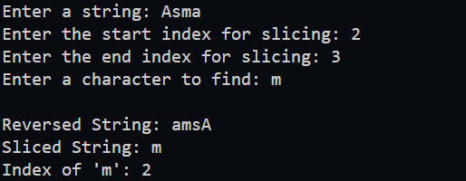

## Write a Java program that implements several methods for manipulating strings and uses them in the main method. 

## Methods to Implement:
1. **Method to Count Factors**  
   - **Signature:**  
     ```java
     public static String reverse(String value)
     ```
   - **Description:**  
     This method should take a string as input and return its reverse.

2. **Method to Check if a Number is Prime**  
   - **Signature:**  
     ```java
     public static String slice(String value, int start, int end)
     ```
   - **Description:**  
     This method should return a substring of the input string from the start index (inclusive) to the end index (exclusive).

3. **Method to Retrieve All Factors**  
   - **Signature:**  
     ```java
     public static int indexOf(String value, char find)
     ```
   - **Description:**  
     This method should return the index of the first occurrence of the character find in the string value. If the character is not found, return -1.

4. **Main Method**  
   - **Signature:**  
     ```java
     public static void main(String[] args)
     ```
   - **Description:**  
     1. Prompt the user to input a string.
     3. Prompt the user to input a start and end index.
     3. Prompt the user to input a character to find in the string.
     4. Use the reverse method to reverse the string and print the result.
     5. Use the slice method to extract the substring and print it.
     6. Use the indexOf method to locate the character and print its index (or -1 if not found).


## Expected Output Example:



---



---




## Constraints:
- The program should handle all possible string inputs without restrictions.
- Input indices for slicing will always be valid (i.e., start <= end and within bounds). Input validation for slicing indices is not required.
 
## Hints:
- Use only for loops to implement the tasks.
- Avoid using any built-in string manipulation methods such as `substring`, `toCharArray`, or others.
- The only allowed method is `length()` to determine the length of the string.
