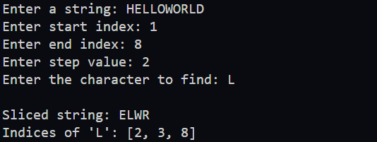

## Java String Manipulation Program

This program implements several methods for string manipulation and demonstrates their usage in the main method.

---

## Methods to Implement:

### 1. **Slice a String**
- **Signature:**  
  ```java
  public static String slice(String value, int start, int end, int step)
  ```

  - **Description:**  
    This method returns a substring of the input string from the start index (inclusive) to the end index (exclusive) with a step value.

  - **Constraints:**
    - The step value determines which characters are included in the result.
    - A step of 1 includes every character between start and end.
    - Larger steps skip characters based on the step value.

### 2. **Find All indices of a Character**  
  - **Signature:**  
    ```java
    public static ArrayList<Integer> getIndices(String value, char find)
    ```
    - **Description:**  
      This method returns the indices of the given character find in the string value as an ArrayList<Integer>.

    - **Example:** 
      For the string "hello" and character 'l', the method should return [2, 3].

### 3. **Main Method**  
  - **Signature:**  
    ```java
    public static void main(String[] args)
    ```
    - **Description:**  
      1. Prompt the user to input a string.
      2. Prompt the user to input a start and end index and step value.
      3. Prompt the user to input a character to find in the string.
      4. Use the slice method to extract the substring and print it.
      5. Uses the getIndices method to locate all indices of the character and prints the result.


## Expected Output Example:


---


---




## Constraints:
- The program should handle all possible string inputs without restrictions.
- Input indices for slicing will always be valid (i.e., start <= end and within bounds). Input validation for slicing indices is not required.
- The step value will always be greater than 0.
 
## Hints:
- Use only `for` loops or `while` loops to implement the tasks.
- Avoid using any built-in string manipulation methods such as `substring`, `toCharArray`, or others.
- The only allowed method is `length()` to determine the length of the string.
