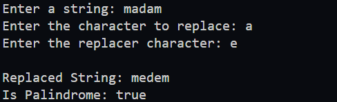
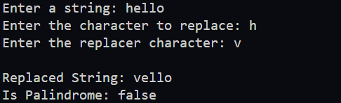
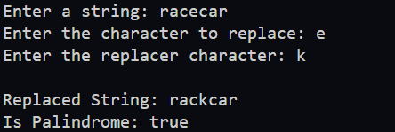

## Java String Manipulation Program

This program demonstrates two key string manipulation tasks: replacing characters in a string and checking if a string is a palindrome. The main method integrates these functionalities, allowing user interaction to showcase the results.

---

## Methods to Implement:

### 1. **Replace character in a String**
- **Signature:**  
  ```java
  public static String replace(String value, char find, char replacer)
  ```

  - **Description:**  
    This method returns a new string where all occurrences of the character find in the input string are replaced with the character replacer.

  - **Constraints:**
    The input string may contain any characters.
    All occurrences of find are replaced.

### 2. **Check if String is a Palindrome**  
  - **Signature:**  
    ```java
    public static boolean isPalindrome(String value)
    ```
    - **Description:**  
      This method checks if the given string is a palindrome.A string is a palindrome if it reads the same forwards and backwards, ignoring case.

    - **Example:** 
        - "madam" is a palindrome.
        - "racecar" is a palindrome.
        - "hello" is not a palindrome.
         
    - **Constraints:**
        - Ignore case during the check.

### 3. **Main Method**  
  - **Signature:**  
    ```java
    public static void main(String[] args)
    ```
    - **Description:**  
      1. Prompt the user to input a string.
      2. Prompt the user to input a `find` character and a `replacer` character.
      3. Use the `replace` method to replace the specified character.
      4. Use the `isPalindrome` method to check if the input string is a palindrome.
      5. Print the modified string and the palindrome status.

## Expected Output Example:



---



---




## Constraints:
- The program should handle all possible string inputs without restrictions.
 
## Hints:
- Use only `for` loops or `while` loops to implement the tasks.
- Avoid using any built-in string manipulation methods such as `substring`, `toCharArray`, or others.
- The only allowed method is `length()` to determine the length of the string.
